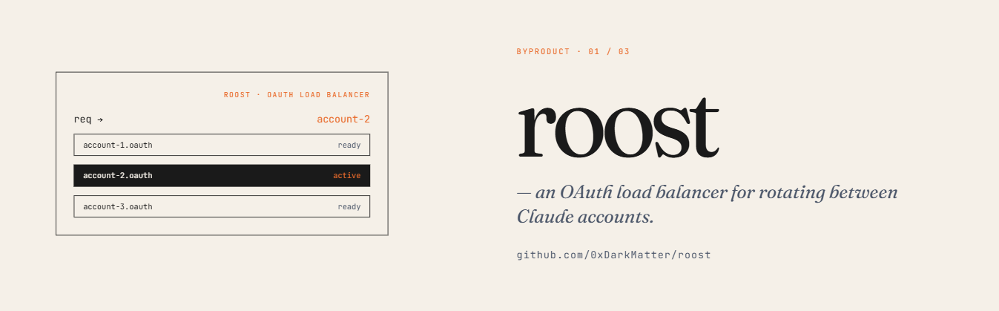
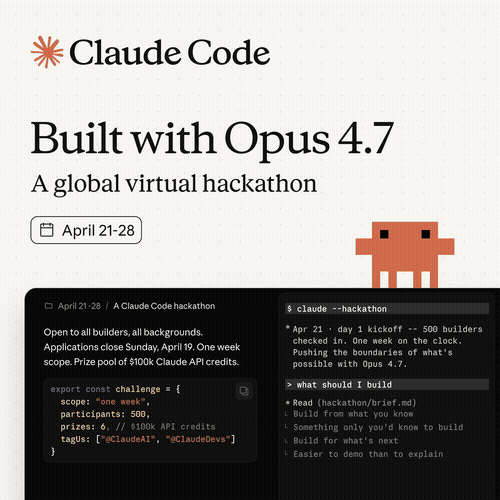

[](https://github.com/forma-tools/forma)
[](https://www.python.org/downloads/)
[](LICENSE)
[](CHANGELOG.md)
[](https://www.anthropic.com/)


> Pick the healthiest Claude Code OAuth profile — health taxonomy + load balancer for local OAuth profiles. Works with any plan (Max / Pro / Team), with richer usage data on Max.

**Built for the Claude Opus 4.7 Hackathon.**



## Trial dispatch (recommended pattern)

For headless `claude` workloads (Axiom trials, scripted runs, parallel
batches), the simplest and safest pattern is to let claude own its own
credentials file and use roost purely as a picker:

```bash
PROFILE=$(roost pick --strategy round-robin)
CLAUDE_CONFIG_DIR=~/.claude-profiles/$PROFILE claude -p ...
```

Claude auto-refreshes its OAuth chain when the access_token expires and
writes the new chain back to the same file. By pointing claude directly
at the live profile dir, the refresh chain stays in sync with what roost
sees — no orphan-source bug, no coordination needed.

For batches: pre-refresh once, then fan out:

```bash
for p in $(roost list); do roost refresh $p; done
for i in $(seq 1 8); do
  P=$(roost pick --strategy round-robin)
  CLAUDE_CONFIG_DIR=~/.claude-profiles/$P axiom solve --task $i &
done
wait
```

For long-running agents (multi-day), dedicate one profile and exclude it
from the rotation pool:

```bash
# Agent owns roamhq permanently:
CLAUDE_CONFIG_DIR=~/.claude-profiles/roamhq claude -p ... &

# Trial fleet routes around it:
roost pick --avoid roamhq
```

**Do not** snapshot `credentials.json` and hand the copy to a workload
that may run long enough to trigger a refresh. Claude refreshes inside
the snapshot, the OAuth server consumes the snapshot's refresh_token,
and the live source profile is orphaned — its refresh_token is now
server-side-invalid and `roost refresh <name>` will return
`invalid_grant`. See `docs/findings.md` §6 for the empirical verification
and the architectural reason.

## Recent updates

[**Releases on GitHub**](https://github.com/0xDarkMatter/roost/releases) ·
[Full CHANGELOG](CHANGELOG.md)

### v0.5.0 — credential rotation safety

> **Note (added 2026-05-11):** the `--lease` and `roost snapshot`
> surface ship and work as described below, but empirical testing
> revealed claude itself auto-refreshes credentials.json and writes the
> new chain back to the read-from file. This makes the snapshot pattern
> unsafe for any workload that triggers a refresh (typically ≥8h
> wall-time). The current recommendation for trial dispatch is the
> "Trial dispatch (recommended pattern)" section above — direct
> `CLAUDE_CONFIG_DIR` against the live profile dir, no snapshot. The
> v0.5.0 features remain available for sub-8h cases or workloads that
> can't read `~/.claude-profiles/<name>/` directly. See
> `docs/findings.md` §6.

- **`roost exec --lease` (default on)** — pins the picked profile against
  `roost refresh` for the child's lifetime. A background probe can no longer
  rotate the OAuth token under a long-running child (`LEASE_HELD`, exit 7).
  `--no-lease` opts out; `--lease-for <dur>` overrides the TTL (default:
  `timeout * 1.2` or 30m). Released in a `finally` block — Ctrl+C and
  exceptions both clean up.
- **`roost snapshot <profile> <out-path>`** — documented point-in-time credential
  copy with a stderr warning. Makes the "copy once, use for duration" pattern
  discoverable for external consumers (containers, sub-processes) that can't
  participate in the lease system.

### v0.4.0 — symmetric API, observability, integration surfaces

- **Symmetric profile management** — `roost remove`, `roost rename`, plus
  the read-only `roost which` (returns what `pick` *would* choose without
  side effects on `picks.log` / `last-pick.json`).
- **Pick algorithm** — `--avoid <name>` (repeatable), `--max-cost <pct>`
  (gate by monthly overage), `--fallback <name>` (last-resort safety net),
  `--explain` (decision-tree rendering), and a new `lowest-overage`
  strategy.
- **Observability** — `roost stats` aggregates `picks.log` (totals,
  durations, failure rates); opt-in `roost report` aggregates a new
  `usage-log.ndjson` per-probe time-series with sparklines + linear
  burn-rate projection. Toggle via `roost config usage-log {on|off|status}`
  or `CLAUDE_LB_USAGE_LOG=1`.
- **Reliability** — per-profile exponential backoff for `network_error`
  (30s → 60s → 120s → 240s → 480s, capped) so a flapping endpoint stops
  thundering-herd. `refresh --jitter <s>` for cron-spread.
- **Integration surfaces** — `roost shellinit` emits a transparent
  `claude` wrapper for bash/zsh/fish/pwsh; `roost trace <name>` dumps
  request/response + classifier reasoning (token redacted); `roost top`
  is a Rich `Live` TUI of the status table.
- **Live integration tests** — `pytest -m live` exercises the full CLI
  against the local fleet; default `pytest` keeps the mocked suite
  hermetic.

### v0.3.0 — onboarding + observability

- **`roost add <name>`** — import an existing `.credentials.json` (default
  source: `~/.claude/.credentials.json`) into the multi-profile layout. Cuts
  onboarding from "manually copy files into a directory I haven't created"
  to one command.
- **`roost status` surfaces Anthropic-side incidents** above the profile table
  by polling `https://status.claude.com/api/v2/summary.json` (60s cache,
  stale-fallback). Silent when all clean; folds into `meta.platform_status`
  on `--json`. Opt out with `--no-platform-status`.
- **`roost doctor` status.claude.com check** — always-fresh, WARN-level.
  Helps distinguish "my setup is broken" from "Anthropic is degraded".
- Audience widened: any Claude Code OAuth account (Max / Pro / Team).

### v0.2.0 — exec, multi-pick, operational tooling

- **`roost exec <cmd...>`** — pick a profile, set `ROOST_PROFILE`,
  exec the command, propagate child rc. With `--auto-refresh` and
  `--retry-on-429`.
- **`roost pick --auto-refresh`** — inline-refresh expired tokens before
  picking. Folds the two-step preflight into one call.
- **`roost pick --count N` (alias `-n N`)** — multi-pick for parallel
  dispatch workflows.
- **Shell completion** (`roost --install-completion`) — bash/zsh/fish/pwsh.
- **`roost history`** — read the picks.log audit trail with `--profile`,
  `--since 30m`, `--tail N` filters.
- **`refresh --soon DURATION`** — anticipatory refresh; cron-friendly
  (`*/15 * * * * roost refresh --soon 30m --json`).

## Architecture

```
  ~/.claude-profiles/<name>/.credentials.json
                    │
                    ▼  discover_profiles()
         ┌──────────────────┐    probe (async)    ┌───────────────────────┐
         │    discovery     │───────────────────► │   api.anthropic.com   │
         └────────┬─────────┘ ◄── classify ────── │   GET /oauth/usage    │
                  │               8 states         └───────────────────────┘
                  ▼
         ┌────────────────────────────────────────┐
         │  cache  ·  health.json  ·  picks.log   │
         └───────────────────┬────────────────────┘
                             │  pick(strategy)
                             ▼
                  ┌──────────────────────┐
                  │  sticky              │
                  │  least-used          │──► ROOST_PROFILE=‹name›
                  │  round-robin         │              → claude ...
                  │  weighted            │
                  └──────────────────────┘
```

## Why this exists

If you run more than one Claude Code account — for redundancy, quota
spreading, or just personal-vs-work separation — there's nothing built-in
that picks the right one at dispatch time. Spawning against an expired,
dead, or quota-exhausted profile burns attempts on 401s and rate-limit
retries.

`roost` is a **stateless one-shot CLI primitive** that answers
"which of my profiles is healthy right now?" as an exit-code-friendly
scripting call, reading utilization numbers straight from Anthropic's
OAuth usage endpoint.

```bash
ROOST_PROFILE=$(roost pick) my-script ...
```

It works with any Claude Code OAuth account (Max / Pro / Team). On Max
plans you get the full session/weekly utilization picture; on Pro/Team
the tool still classifies health correctly (network / auth / rate-limit
states) but `usage` data is null.

## Install

Not on PyPI. Install from a local clone:

```bash
git clone https://github.com/0xDarkMatter/roost.git
cd roost
uv tool install --editable .

roost --version    # → roost 0.5.0
```

To upgrade later, pull + reinstall:

```bash
git -C roost pull && uv tool install --reinstall --editable roost
```

Or use the built-in `roost update --apply` on POSIX (Windows has a
[self-upgrade caveat](#diagnostics)).

**Why `--editable`?** It links the install to your clone, so `git pull`
picks up new code without reinstalling. The downside: deps added in a new
release require a re-sync (`uv tool install --reinstall --editable .` from
the clone), which `roost update --apply` handles automatically.

## Setup

`roost` needs more than one OAuth profile on disk to balance between
them. The standard `claude` CLI writes a single profile to
`~/.claude/.credentials.json`. `roost add` imports that file into a
multi-profile layout under `~/.claude-profiles/<name>/.credentials.json`,
which is what `roost` discovers and rotates between.

Typical onboarding:

```bash
# 1. Sign in to your first account (uses the standard Claude Code flow)
claude login

# 2. Import that credentials file as a named profile
roost add personal

# 3. Sign in to a different account (overwrites ~/.claude/.credentials.json)
claude logout && claude login

# 4. Import the new state as another named profile
roost add work

# 5. Confirm both are visible and ready
roost status
```

`roost add` copies (doesn't move) the source file, so the standard
`claude` command continues to work against whichever account you most
recently logged into.

**Want one command per profile?** Wrap it in a shell function — roost
deliberately doesn't ship its own browser-login orchestration (the
`claude` CLI owns that):

```bash
add_profile() {
  claude logout 2>/dev/null
  claude login && roost add "$1"
}

add_profile personal
add_profile work
```

**Custom locations:**

| Variable | Purpose |
|----------|---------|
| `CLAUDE_LB_PROFILES_DIR` | Override the profiles tree (default `~/.claude-profiles`) |
| `CLAUDE_CONFIG_DIR` | Single-profile fallback: if set to a dir with a direct `.credentials.json`, loaded as profile `default` |

## Quick Start

```bash
roost probe                          # Live-probe all profiles
roost status                         # Cached health table
roost pick                           # → personal  (one profile name, exit 0)
roost refresh --expired              # Refresh any profile whose token expired
eval "$(roost pick --export)"        # ROOST_PROFILE=personal in shell
roost status --json | jq '.meta'     # Machine-readable summary
```

## Commands

### Discovery

```bash
roost list                           # Names of discovered profiles
roost list --json                    # {data: [...], meta: {count}}
```

### Profile management

```bash
roost add personal                   # Import ~/.claude/.credentials.json as 'personal'
roost remove personal                # Delete a profile dir + drop cache entry
roost rename old new                 # Move profile dir + reset cached health
roost rename old new --force         # Overwrite an existing destination
```

`add` / `remove` are symmetric. `remove` recursively deletes the directory
under `~/.claude-profiles/<name>/`, drops the health-cache entry, and clears
`last-pick.json` if it pointed at the removed profile. The standard
`~/.claude/.credentials.json` (the source `add` copies from) is **never**
touched by either command.

`rename` moves the directory atomically and drops the old cache entry; the
new name re-classifies on the next probe. `--force` removes an existing
destination first, matching the symmetry of `add --force`.

### Health

```bash
roost probe                          # Live-probe all (concurrent)
roost probe account-a                   # Live-probe one
roost status                         # Cached table + Anthropic platform-status header (stderr) + summary (stdout)
roost status --no-cache              # Ignore cache; full re-probe (incl. status.claude.com)
roost status --no-platform-status    # Skip the status.claude.com fetch
roost status --cards                 # Render one capacity-card panel per profile instead of the table
roost widget                         # Self-contained HTML capacity cards for Claude Code's show_widget tool
roost show account-a                    # Detail for one profile
roost invalidate account-a              # Drop this profile's cache entry
```

`--cards` renders one capacity-card panel per profile (Session / Weekly / Fable /
Overage bars) to stderr instead of the table — same data, denser per-profile view.

`roost widget` renders the same data as a single self-contained HTML fragment on
**stdout**, sized for Claude Code's `show_widget` tool: no `<script>` tag at all, no
CDN script or stylesheet, no webfont, no outbound request of any kind — the tool
renders it behind a strict CSP that blocks all of them.

The page is a fleet dashboard header above a grid of per-profile cards:

| Element | What it shows |
|---------|---------------|
| **Header** | Profile counts, the profile `pick` would currently return, and a concentric ring per profile — outer arc Weekly, inner arc Fable |
| **Claude Status panel** | Live component states from status.claude.com, beside a per-service incident calendar. Hover a service to swap the calendar to that service's history |
| **Profile card** | Session / Weekly / Fable / Overage as bars or as 10×10 square grids, each with its own absolute reset time, plus dispatch stats from roost's own logs |
| **Bars / Grid toggle** | Switches every card between the two gauge styles. Pure CSS — a hidden checkbox and a sibling selector, so the page keeps its no-`<script>` guarantee |

The recommendation in the header uses **`which` semantics**: it runs the pick
algorithm without writing `picks.log` or moving the stickiness pointer, so
rendering a dashboard never changes which profile your next dispatch gets.

The incident calendar is labelled **incidents**, never *uptime*. Statuspage's
public API exposes incident records, not uptime measurements, and it returns
only the most recent ~50 incidents — so the window is read from the response
(currently ~29 days) rather than assumed. A day with nothing reported is
"no incident reported", which is a weaker claim than "100% up".

`--max-kb` (default 28) is the byte budget that decides whether `show_widget`
renders the page inline or spools it to a file. When the page would exceed it,
roost sheds **detail** first — the alternate gauge view, then the per-service
history — and only drops a profile card as a last resort, warning on stderr if
it does. A fleet overview that quietly omits an account is worse than one
missing a nicety.

### Picking

```bash
roost pick                           # Default: sticky (cache-locality)
roost pick --strategy least-used     # Lowest weekly % wins
roost pick --strategy round-robin    # Rotate through profiles
roost pick --strategy weighted       # Combine weekly + session usage
roost pick --strategy lowest-overage # Lowest monthly overage % wins
roost pick --require-ok              # Exit 5 if none are ok
roost pick --export                  # Shell-sourceable VAR=value
roost pick --json                    # {data: {name, health, rationale}}
roost pick --warn-at 80              # Stderr warning when session/weekly ≥80%
roost pick --auto-refresh            # Refresh auth_expired profiles inline, then pick
roost pick --count 3                 # Return up to 3 profiles (newline-separated)
roost pick -n 3 --strategy least-used  # Short form; lowest-3 weekly%
roost pick --avoid account-b         # Exclude a profile (repeatable)
roost pick --avoid a --avoid b       # Exclude multiple
roost pick --max-cost 80             # Skip profiles ≥ 80% monthly overage
roost pick --fallback account-a      # If primary pick fails, return this profile
roost pick --explain                 # Render the decision tree to stderr
```

`--auto-refresh` folds the `refresh --expired` preflight into `pick` itself:
any cached `auth_expired` profile with a stored refresh token is refreshed
before selection. Refresh failures are non-fatal — the expired profile is
filtered out and a healthy one is returned if any exists.

`--count N` returns up to N profiles in strategy order. If fewer than N pass
the filter ladder, returns what's available (exit 0). Each pick is logged to
`picks.log`; only the primary (first) pick updates the stickiness state, so
a subsequent single-pick call honours the primary. Stickiness is ignored when
`N > 1`. `--export` is rejected with `--count > 1` — use `--json` to consume
multiple names programmatically. The JSON shape flips to an array when
`N > 1`:

```bash
roost pick --count 3 --json
# {"data": [{...}, {...}, {...}], "meta": {"count": 3, "requested": 3, ...}}
```

`--avoid <name>` is repeatable; composes with all strategies and with
`--count`. If the sticky pick is in the avoid set, the sticky shortcut is
skipped and the underlying strategy runs.

`--max-cost N` excludes profiles whose monthly overage utilization is ≥ N%.
Profiles **without** overage data (Pro/Team plans, or Max plans with overage
disabled) are NEVER excluded — they have no cost signal to gate against.

`--fallback <name>` is a script-friendly safety net: if the primary pick
fails, return this profile name (with a stderr warning) instead of exiting
non-zero. The fallback is honoured only when the named profile exists in
discovery and is not also in `--avoid` — non-existent fallbacks propagate
the original failure so typos don't silently succeed.

`--explain` renders a decision tree to stderr (or, in `--json` mode, folds
the same data into `data.explain`/`error.details.explain`):

```text
Pick decision (strategy=least-used)
┌────────────┬────────────┬───────────────┐
│ Profile    │ Status     │ Score / why   │
├────────────┼────────────┼───────────────┤
│ account-a  │ excluded   │ avoid (--avoid)│
│ account-b  │ ◀ chosen   │ score=10.00   │
│ account-c  │ candidate  │ score=20.00   │
└────────────┴────────────┴───────────────┘
  Rationale: least-used: lowest weekly usage among healthy
```

### Which (read-only pick)

```bash
roost which                          # What pick WOULD return — no side effects
roost which --strategy least-used    # Honours all pick flags
roost which --avoid account-a        # Including --avoid
roost which --json                   # {data: ..., meta: {side_effects: false}}
```

`which` mirrors `pick`'s decision logic exactly but **does not** write to
`picks.log` or update `last-pick.json`. Useful for "why is it choosing X?"
debugging — pair with `--explain` to see the full decision tree without
contaminating stickiness state. Probing is still allowed (that's freshness,
not state).

### Refresh

```bash
roost refresh account-a                 # Refresh one profile's OAuth token
roost refresh --all                  # Refresh every discovered profile
roost refresh --expired              # Refresh only past-expiry profiles
roost refresh --soon 30m             # Refresh anything expiring within 30 min
roost refresh --soon 1h --json       # Cron-friendly: */15 * * * * <-- this
roost refresh --all --jitter 5       # Random 0-5s delay before each refresh
```

`--soon DURATION` is anticipatory: it covers already-expired tokens AND tokens
expiring within the window. Combined with a 15-min cron, it keeps the fleet
warm without `--auto-refresh` having to fire mid-spawn (with the latency cost
that implies).

`--jitter <seconds>` adds a per-profile random delay 0..N before each refresh.
Cron-friendly: spreads concurrent invocations across the window so N machines
sharing one credential set don't all hit Anthropic's OAuth endpoint at the
top of the minute.

`refresh` POSTs the stored refresh token to Anthropic's OAuth endpoint,
atomically rewrites `.credentials.json` (preserving non-oauth fields), and
invalidates the health cache. A cron hook like
`0 * * * * roost refresh --expired --json` keeps the fleet warm.

### Running commands

```bash
# The composed idiom: pick + refresh + dispatch in one call.
roost exec --auto-refresh -- claude --dangerously-skip-permissions "write fn"

# With explicit strategy, timeout, and retry-on-rate-limit:
roost exec --strategy least-used --timeout 300 --retry-on-429 1 -- claude ...

# Dry-run: show what would execute without talking to the API
roost exec --dry-run -- claude --help
# → ROOST_PROFILE=account-a claude --help
```

`roost exec` picks a profile, sets `ROOST_PROFILE=<name>` in the
child's env, and execs the command. The child's exit code becomes roost's
exit code, so scripts can treat `exec` as a transparent wrapper. stdin/stdout/
stderr are inherited (interactive children work unchanged). Every run is
audited to `picks.log` with duration + rc.

Key flags:

- `--auto-refresh` — inline-refresh expired tokens before picking
- `--retry-on-429 N` — if the child fails AND the profile re-probes as
  rate-limited/session-exhausted, retry once with a different profile (best-effort)
- `--timeout S` — kill after S seconds (exit 124)
- `--dry-run` — print the env + command, don't execute
- `--var-name NAME` — override `ROOST_PROFILE`
- `--log-full-argv` — log the full child argv instead of just argv[0] (may leak secrets)
- `--lease` (default on) / `--no-lease` — acquire an expiring lock on the picked
  profile before spawning the child. While held, `roost refresh` returns `LEASE_HELD`
  (exit 7) without rotating the credential, so a background probe can't invalidate
  the token under a long-running child. Released unconditionally on exit (Ctrl+C
  included). Use `--no-lease` for short-lived one-shot children where the overhead
  is unwanted.
- `--lease-for <duration>` — override the lease TTL (e.g. `30m`, `2h`). Defaults
  to `timeout * 1.2` when `--timeout` is set, else 30 minutes.

### Credential rotation safety

```bash
# Exec leases automatically — nothing to do.
roost exec -- claude --dangerously-skip-permissions "long task"

# Opt out for throwaway commands where the overhead is unwanted:
roost exec --no-lease -- claude --version

# Snapshot: copy credentials once to a stable path for external consumers.
roost snapshot personal /tmp/creds-personal.json
# → stderr: "Snapshot written. roost will NEVER touch this file."
# Use the snapshot in your workload; it doesn't rotate under you.
```

`roost snapshot <profile> <out-path>` copies the profile's live `credentials.json`
to a stable path. External consumers (Docker containers, subprocesses) that mount
or reference that path get a frozen copy that will never be rotated. The snapshot
does not participate in the lease system — it's just a documented `cp` with a
prominent warning that the copy is not kept fresh.

### Scripting (lower-level)

```bash
# If `exec` doesn't fit, drop to pick + eval yourself:
profile=$(roost pick --auto-refresh 2>/dev/null)
case $? in
  0) export ROOST_PROFILE="$profile" ;;
  2) echo "All profiles dead or expired: run claude login --profile <name>" ;;
  5) echo "No profile is currently ok — retry or relax --require-ok" ;;
  6) echo "All profiles throttled — back off" ;;
  9) echo "All profiles exhausted — operator intervention required" ;;
esac

# Parallel dispatch to N accounts via --count
for profile in $(roost pick --count 3 --strategy least-used); do
    AXIOM_CLAUDE_PROFILE=$profile axiom launch-parcel &
done
wait
```

### History

```bash
roost history                        # Last 20 picks + exec runs
roost history --tail 50              # Last 50
roost history --profile account-a       # Filter to one profile
roost history --since 1h             # Last hour ('30m', '1h', '2d', '1w', or seconds)
roost history --json                 # Structured output
```

Reads `picks.log` (the audit trail every pick + exec writes to). Useful for
"what did the daemon dispatch in the last hour?" without grepping a
tab-separated file.

### Stats & reporting

Two complementary aggregations: `stats` summarises the **picks.log** audit
trail; `report` summarises the **usage-log.ndjson** time-series of probe
outcomes (opt-in — see `roost config usage-log on`).

```bash
roost stats                          # Pick + exec totals, p50/p95 dur, failure rate
roost stats --since 1h               # Last hour only
roost stats --profile account-a      # Filter to one profile
roost stats --json                   # Structured envelope

roost config usage-log on            # Enable per-probe NDJSON logging
roost config usage-log status        # Check current state
roost config usage-log off           # Disable

roost report                         # Per-profile min/max/avg of weekly_pct
roost report --metric session_pct    # Other metrics: session_pct | fable_pct | sonnet_pct | opus_pct | overage_pct | spend_pct
roost report --sparkline             # Add a Unicode sparkline of the time-series
roost report --project               # Linear burn-rate forecast: ETA → 100%
roost report --since 1d --json       # Filter + structured output
```

Sample report output (with `--sparkline --project`):

```text
Usage report — weekly_pct
┌────────────┬─────────┬─────┬─────┬──────┬────────┬──────────┬───────────┐
│ Profile    │ Samples │ Min │ Max │ Avg  │ Latest │ Trend    │ ETA → 100%│
├────────────┼─────────┼─────┼─────┼──────┼────────┼──────────┼───────────┤
│ account-a  │     112 │ 5.0 │ 73.0│ 41.2 │   72.0 │ ▁▂▄▆▇█   │ 2h 14m    │
│ account-b  │      98 │10.0 │ 22.0│ 16.8 │   18.0 │ ▃▅▄▄▃▂   │ —         │
└────────────┴─────────┴─────┴─────┴──────┴────────┴──────────┴───────────┘
```

The usage log is **opt-in** — disabled by default. Enable via `roost config
usage-log on` (writes a marker at `<config>/usage-log.enabled`) or set
`CLAUDE_LB_USAGE_LOG=1`. Once enabled, every successful probe appends one
JSON record to `<config>/usage-log.ndjson`. The file is append-only with no
rotation; truncate manually (`> usage-log.ndjson`) or via the API
(`usage_log.truncate()`).

### Shell completion

```bash
roost --install-completion           # Install for your shell (bash/zsh/fish/pwsh)
roost --show-completion              # Print the script without installing
```

Once installed, `<TAB>` completes commands, flags, profile names (for `show`,
`probe`, `refresh`, `invalidate`, `history --profile`, `--avoid`,
`--fallback`), and `--strategy` values (`sticky | least-used | round-robin |
weighted | first-healthy | lowest-overage`).

### Shell integration (transparent `claude` wrapper)

```bash
# bash / zsh — install once into your shell rc
eval "$(roost shellinit)"

# fish
roost shellinit | source

# PowerShell
roost shellinit | Out-String | Invoke-Expression

# Override auto-detection
roost shellinit --shell fish
```

`shellinit` emits a shell function that wraps `claude` to call
`roost exec --auto-refresh -- claude "$@"`. After eval, every `claude`
invocation routes through roost transparently — profile selection, auth
refresh, and audit logging all happen automatically. Remove the function
from your shell rc to revert.

### Live status TUI

```bash
roost top                            # Live-refreshing status table; Ctrl+C to exit
roost top --interval 5               # Refresh every 5 seconds (default 2s)
```

`top` is a thin Rich `Live` wrapper around the same status data as
`roost status`. Designed to leave on a side monitor during incidents — for
one-shot snapshots, use `status` instead.

### Diagnostics

```bash
roost probe --raw                    # Dump untouched /api/oauth/usage body
roost probe --raw --json             # Machine-readable raw dump
roost trace account-a                # Verbose probe + classifier reasoning
roost trace account-a --json         # Same, structured output
```

`--raw` bypasses classification and the cache write; useful for inspecting
unknown fields Anthropic might add, or for capturing test fixtures.

`trace <name>` runs a single full probe and dumps:
- the request envelope (URL, headers — bearer token redacted to last 4 chars)
- the raw response (status, headers, body)
- the classifier's decision (health, error, reset timestamps)

Designed to be shareable in bug reports — the token redaction is enforced in
both text and JSON modes.

## Health Taxonomy

Nine states. Signals come from a single probe against `/api/oauth/usage`
plus a local check of the stored token's `expiresAt`.

| State | Detection | TTL | Next action |
|-------|-----------|-----|-------------|
| `ok` | HTTP 200 with `five_hour < 100` and `seven_day < 100`; also HTTP 403 "scope requirement user:profile" | 5 min | — |
| `rate_limited` | 429 on usage endpoint | `retry-after` s, else 60 s | Retry in N seconds |
| `session_limit` | HTTP 200 with `five_hour.utilization >= 100` | until `five_hour.resets_at` | Skip until session reset |
| `weekly_limit` | HTTP 200 with `seven_day.utilization >= 100` | until `seven_day.resets_at` | Skip until weekly reset |
| `model_limit` | HTTP 200 with an *active* `limits[]` entry at `percent >= 100`, while `seven_day`/`five_hour` are both still under 100 (e.g. the aggregate weekly window at 76% with the Fable-scoped window exhausted) | until that limit's `resets_at` | Skip until that model's window resets |
| `auth_expired` | Local: stored `expiresAt` is past (no network call) | invalidates on refresh | `roost refresh <name>` |
| `auth_dead` | HTTP 401 on usage endpoint | manual | `claude login --profile <name>` |
| `network_error` | timeout / DNS / TLS / refused | 30 s | Transient; retry |
| `unknown` | other 4xx/5xx, malformed body | 60 s | Inspect with `show` |

Classification order: network exception → local-expiry → 200 (weekly → session →
active model-scoped limit → ok) → 401 → 403+scope-check → 429 → unknown.
`weekly_limit`/`session_limit` are checked before `model_limit`, so a profile that's
both weekly-exhausted and model-exhausted reports `weekly_limit` — the broader,
longer-lasting condition wins. See [`docs/SPEC.md`](docs/SPEC.md) §6 +
[`src/claude_lb/taxonomy.py`](src/claude_lb/taxonomy.py).

## Picker Strategies

| Strategy | Behaviour |
|----------|-----------|
| `sticky` **(default)** | Stick to last-picked profile inside a 300 s window (cache-locality). Falls through to `least-used` otherwise. |
| `least-used` | Lowest `weekly_pct` wins. |
| `round-robin` | Rotate past the last-picked profile. |
| `weighted` | `weekly_pct / (session_pct + 1)` — lower is better. |
| `first-healthy` | First `ok` in discovery order. Deterministic for tests. |
| `lowest-overage` | Lowest monthly overage `utilization` wins. Profiles without overage data rank as 0 (best) so Pro/Team plans are preferred over a Max plan with active overage. |

Stickiness window: `--stickiness <s>` or `CLAUDE_LB_STICKINESS=<s>`. Set to `0` to disable.

### Composing filters with strategies

| Flag | Effect |
|------|--------|
| `--avoid <name>` (repeatable) | Exclude named profiles. Composes with all strategies + `--count`. Bypasses sticky if the sticky pick is avoided. |
| `--max-cost <pct>` | Drop profiles with monthly overage `utilization >= pct`. Profiles without overage data are not gated. |
| `--require-ok` | Drop anything that isn't currently `ok`. |
| `--fallback <name>` | Last-resort safety net at the CLI layer: when the primary pick fails, return this name (with stderr warning) instead of exiting non-zero. |
| `--explain` | Stream the decision tree to stderr (text mode) or fold it into `data.explain` / `error.details.explain` (JSON mode). |

## Exit Codes

| Code | Meaning |
|------|---------|
| 0 | Success |
| 1 | Unexpected error — also the current fallback for `pick`/`which`/`exec` when every profile is `model_limit`-exhausted. `ALL_MODEL_LIMIT` has no dedicated entry in `cli.REASON_TO_EXIT`, so it falls through to this generic code with the generic "Pick failed." message rather than a code of its own like `ALL_WEEKLY` gets. |
| 2 | `AUTH_REQUIRED` — all profiles `auth_dead` or `auth_expired`; run `roost refresh --expired` or `claude login` |
| 3 | `NOT_FOUND` — unknown profile given to `show` / `probe` / `refresh` / `invalidate` |
| 4 | `VALIDATION` — bad flag (e.g. unknown strategy, or `refresh` with no args) |
| 5 | `FORBIDDEN` — `--require-ok` but no profile is `ok` |
| 6 | `RATE_LIMITED` — all profiles throttled |
| 7 | `CONFLICT` — `refresh` blocked: either a file-lock race (another process is refreshing the same profile), or the profile is leased by an active `roost exec` child (`LEASE_HELD`). Retry after the child exits. |
| 8 | `TIMEOUT` |
| 9 | `UNAVAILABLE` — no profiles, or all terminal-bad (`NO_PROFILES`, `ALL_WEEKLY`, `ALL_TERMINAL`) |

## Environment Variables

| Variable | Default | Effect |
|----------|---------|--------|
| `CLAUDE_LB_STICKINESS` | `300` | Stickiness window in seconds. `0` disables. Overridden by `--stickiness <s>`. |
| `CLAUDE_LB_PROFILES_DIR` | `~/.claude-profiles` | Absolute path to the profiles tree. Useful for testing or multi-tenant setups. |
| `CLAUDE_LB_USAGE_LOG` | unset | Set to `1`/`true`/`yes`/`on` to enable per-probe NDJSON logging without writing the marker file. Equivalent to `roost config usage-log on` for the current process. |
| `CLAUDE_CONFIG_DIR` | unset | Single-profile fallback: if set to a dir containing a direct `.credentials.json`, loaded as profile `default`. |
| `XDG_CONFIG_HOME` | unset | Linux/macOS: overrides `~/.config/roost/`. Windows uses `%APPDATA%\roost\`. |

## Diagnostics

```bash
roost doctor                 # Check config dir, profiles, credentials, cache, network, status.claude.com, usage-field drift
roost doctor --skip-network  # Offline variant (also skips status-page + drift checks)
roost doctor --json          # Machine-readable

roost update                 # Version + git-upstream ahead/behind check
roost update --json          # meta.update_available tells you if behind
roost update --apply         # git pull --ff-only + uv tool install --reinstall --editable
roost update --apply --no-pull  # Just re-sync deps (useful when a new dep was added locally)
```

**`usage_field_drift`:** `roost doctor` probes one profile and diffs the raw
`/api/oauth/usage` response's top-level keys against what `roost` knows about
(`unknown` keys, `missing` modelled keys, or a modelled key present-but-`null`).
Always WARN-level — an Anthropic-side schema change is never a local
misconfiguration, so this check never fails the doctor run. It's the check
that would have caught the `seven_day_opus`/`seven_day_sonnet`-going-null
shift (see `docs/findings.md`) before it went unnoticed for weeks.

**Windows self-upgrade caveat:** on Windows, `roost update --apply` can't
reinstall itself while running — the current process has its own `.pyd` files
memory-mapped, so `uv tool install --reinstall` hits `EACCES` on those files.
roost detects this and prints the exact workaround. Run the reinstall
from a shell that isn't roost (bash, cmd, or PowerShell):

```bash
uv tool install --reinstall --editable "X:/Forge/claude-lb"
```

POSIX platforms (macOS, Linux) are unaffected — inode-swap semantics let
`os.replace` overwrite in-use shared libraries atomically.

## Cache & Filesystem

| Purpose | Path |
|---------|------|
| Cache (Linux/macOS) | `~/.config/roost/health.json` |
| Cache (Windows) | `%APPDATA%\roost\health.json` |
| Pick log | `<config>/picks.log` (tab-separated, 10 MB rotation) |
| Last-pick state | `<config>/last-pick.json` |
| Platform-status cache | `<config>/platform-status.json` (60s TTL, used by `status`) |
| Usage log (opt-in) | `<config>/usage-log.ndjson` (one JSON record per probe; no rotation) |
| Usage-log marker | `<config>/usage-log.enabled` (presence enables the log) |
| Lease store | `<config>/leases.json` (active exec leases; auto-expiring at read time) |
| Profiles source | `~/.claude-profiles/<name>/.credentials.json` |

Cache writes are atomic (tempfile + `os.replace`). A credentials file's
`mtime` change implicitly invalidates its cache entry — so `claude login` or
`roost refresh` automatically refreshes the classifier on the next probe.

## Requirements

- Python 3.11+
- One or more OAuth profiles under `~/.claude-profiles/<name>/.credentials.json`
  — created via `roost add <name>` (see [Setup](#setup) above)
- Outbound HTTPS access to `api.anthropic.com`

## Monthly Overage (Max-only)

Anthropic Max plans support pay-as-you-go overage when the weekly window is
exhausted. `roost` surfaces it via `usage.extra` on every probe (Pro/Team
profiles return `usage: null` since they don't expose this surface):

```json
"extra": {
  "is_enabled": true,
  "monthly_limit": 31000,
  "used_credits": 31280.0,
  "utilization": 100,
  "currency": "AUD"
}
```

`utilization ≥ 100` means the monthly overage budget is spent — the account
still works but falls back to the hard weekly/session caps until the next
month. The status table shows an **Overage** column (colour-coded) when any
profile has overage enabled.

> **Unit caveat (now documented upstream):** `monthly_limit` and `used_credits`
> (the `extra_usage` block above) are integers whose unit was originally
> undocumented — empirically ×100 currency minor units, i.e. `monthly_limit:
> 31000` with `currency: "AUD"` meant **$310 AUD**, not $31,000 AUD (see
> `docs/findings.md`). Anthropic's API now states the exponent explicitly,
> though on two different blocks: `extra_usage.decimal_places` (not parsed by
> `roost` — `ExtraUsage` doesn't model this field) and a newer sibling
> top-level `spend` block, where `spend.used.exponent` / `spend.limit.exponent`
> give the same minor-unit power (2 = cents) and `roost` stores it verbatim
> as `Usage.spend.exponent`. `roost` does **not** convert `spend.used_minor` /
> `spend.limit_minor` using the exponent — it stores them raw, same as
> `extra_usage` always has, and reports `percent` as the unit-safe signal for
> both. If you need the displayed dollar amount, divide `used_minor` by
> `10 ** exponent` at the call site.

## Platform status (status.claude.com)

`roost status` consults Anthropic's public status page
(`https://status.claude.com/api/v2/summary.json`) and renders a one-line
header above the profile table whenever there's a non-resolved incident
or a degraded component. When everything's operational the header is
omitted entirely. The intent is narrow: catch the case where a profile
*looks* misbehaving but the actual cause is platform-wide.

```text
· Anthropic: All Systems Operational  incident: 'Elevated errors on Claude Opus 4.7' (monitoring, minor)
┌──────────────┬──────┬─────────┬─────────┬──────────────┐
│ Profile      │ Plan │ Health  │ Session │ Weekly       │
│ ...          │      │         │         │              │
```

**Caching:** the fetch is cached at `<config>/platform-status.json` with
a 60s TTL. On cache miss the timeout is 2s. If a fresh fetch fails
(network down, Statuspage flaky, ...) the stale entry is returned
anyway — going dark during an actual incident defeats the point.

**JSON consumers:** `status --json` folds the data into
`meta.platform_status`:

```json
{
  "meta": {
    "count": 3,
    "ok": 3,
    "platform_status": {
      "indicator": "none",
      "description": "All Systems Operational",
      "active_incidents": [
        {
          "name": "Elevated errors on Claude Opus 4.7",
          "status": "monitoring",
          "impact": "minor",
          "shortlink": "https://stspg.io/..."
        }
      ],
      "degraded_components": [],
      "fetched_at": "2026-04-25T10:52:11Z",
      "age_seconds": 0,
      "fetch_error": null
    }
  }
}
```

**Opt out:** `--no-platform-status` skips the fetch entirely (useful for
scripts that don't want any extra HTTP on the hot path). `--no-cache` /
`--refresh` forces a fresh fetch alongside re-probing profiles.

`roost doctor` runs the same check as a WARN-level diagnostic — see
[Diagnostics](#diagnostics).

## Non-goals

- **Not a proxy.** Doesn't sit in the request path. Use
  [CLIProxyAPI](https://github.com/router-for-me/CLIProxyAPI) if you want that.
- **Not an interactive authenticator.** `claude login` creates the
  underlying credentials; `roost add` imports them, `roost refresh`
  extends their lifetime — the browser-based OAuth flow itself is owned by
  the `claude` CLI.
- **Not multi-provider.** Anthropic / Claude Code only.
- **Not persistent.** No daemon, no watchdog. Every invocation is one-shot.

## Forma Protocol

This tool follows the [Forma Protocol](https://github.com/forma-tools/forma):

- `--json` on every command with `{data, meta}` envelope
- Semantic exit codes (0–9)
- `stdout` = data only; `stderr` = tables, progress, warnings
- `[tool.forma]` metadata in [`pyproject.toml`](pyproject.toml)
- See [`docs/SPEC.md`](docs/SPEC.md) for the full specification

## License

MIT — see [LICENSE](LICENSE).
